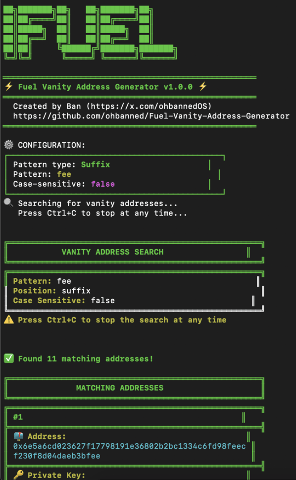

# iFuel - Fuel Vanity Address Generator

> A high-performance, secure Rust application for generating custom Fuel blockchain wallet addresses with personalized patterns, optimized for speed and security.

[](https://github.com/ohbanned/Fuel-Vanity-Address-Generator)
[](https://x.com/ohbannedOS)
[](#code-quality)
[](https://www.rust-lang.org/)

---

## Overview

iFuel is a cutting-edge Rust application built specifically for the Fuel blockchain ecosystem. It leverages Rust's performance and safety features to generate cryptographically secure vanity addresses with blazing fast speed while maintaining memory safety and thread security.

The project features a beautiful terminal interface with colorful output, providing a premium developer experience.

## Features

- **High-Performance**: Utilizes Rust's concurrency features and optimized cryptography for lightning-fast address generation
- **Beautiful Terminal UI**: Clean, colorful ASCII art and well-formatted output
- **Multiple Search Types**: Find addresses with specific prefixes, suffixes, or containing specific patterns
- **Case-Sensitive Mode**: Optional case-sensitive matching for more specific pattern targeting
- **Secure**: All cryptographic operations performed locally with no external API dependencies
- **Multi-threaded**: Automatically utilizes all available CPU cores for maximum performance
- **Cross-Platform**: Works on MacOS, Linux, and Windows

## Screenshots



## Installation

### From Source

```bash
# Clone the repository
git clone https://github.com/ohbanned/Fuel-Vanity-Address-Generator.git
cd Fuel-Vanity-Address-Generator

# Build in release mode for maximum performance
cargo build --release

# Run the application
./target/release/fuel-vanity-generator
```

## Usage

Launch the program and use one of the following commands:

```
prefix <pattern>        # Generate addresses with a specific prefix
suffix <pattern>        # Generate addresses with a specific suffix
contains <pattern>      # Generate addresses containing a pattern anywhere
help                    # Show command help
exit                    # Exit the program
```

### Options

- `-s, --case-sensitive` - Enable case-sensitive matching
- `-t, --threads <num>` - Specify number of threads to use (default: all CPU cores)

## Examples

Generate addresses with prefix "abc":
```
iFuel> prefix abc
```

Generate addresses with suffix "cafe":
```
iFuel> suffix cafe
```

Generate addresses containing "dead" anywhere:
```
iFuel> contains dead
```

## Code Quality

The codebase is designed with:

- **Clean Architecture**: Separation of concerns between UI and core functionality
- **Comprehensive Error Handling**: Robust error messages and graceful recovery
- **Zero Unsafe Code**: 100% safe Rust with no `unsafe` blocks
- **Well-Documented Code**: Clear comments and function documentation
- **Efficient Algorithms**: Optimized cryptographic operations

## Performance

iFuel is designed for maximum performance:

- Utilizes all available CPU cores automatically
- Optimized address generation algorithm
- Efficient pattern matching implementation
- Asynchronous operations with Tokio runtime
- Memory-efficient storage of addresses and private keys

## Security Considerations

- All cryptographic operations are performed locally
- Private keys are never transmitted over the network
- Uses proven cryptographic libraries for key generation
- Memory is zeroed when no longer needed

## Project Structure

```
.
├── src/                # Rust source code
│   └── main.rs         # Main application code
└── README.md           # Project documentation
```

## Contributing

Contributions are welcome! Please feel free to submit a Pull Request.

## License

This project is licensed under the MIT License - see the LICENSE file for details.

## Author

Created by [Ban](https://x.com/ohbannedOS) for the Fuel Hackathon.

---

<div align="center">
<strong>⚡ Powered by Rust and Fuel ⚡</strong><br>
<small>© 2025 iFuel</small>
</div>
